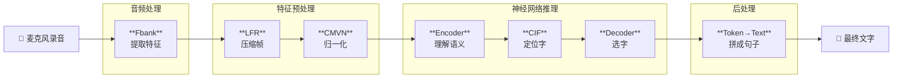
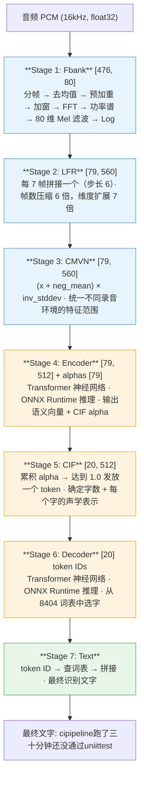

# Paraformer ASR Pipeline 工程师指南

> 面向非算法背景的全栈/客户端工程师，解释 Paraformer 语音识别的每个处理环节。
> 对应 `ParaformerAlignmentTests.swift` 中验证的 7 个阶段。

## 目录

1. [总览：从声波到文字](#总览从声波到文字)
2. [Kaldi 是什么](#kaldi-是什么)
3. [Stage 1: Fbank — 声音的"像素化"](#stage-1-fbank)
4. [Stage 2: LFR — 帧压缩](#stage-2-lfr)
5. [Stage 3: CMVN — 归一化](#stage-3-cmvn)
6. [Stage 4: Encoder — 语义理解](#stage-4-encoder)
7. [Stage 5: CIF — 确定有几个字](#stage-5-cif)
8. [Stage 6: Decoder — 选字](#stage-6-decoder)
9. [Stage 7: Token → Text — 拼字成句](#stage-7-token--text)
10. [完整流程图](#完整流程图)
11. [对齐验证中发现的 Bug](#对齐验证中发现的-bug)

---

## 总览：从声波到文字

语音识别（ASR, Automatic Speech Recognition）的任务是把一段音频波形变成文字。Paraformer 是阿里达摩院开源的非自回归端到端 ASR 模型，整个处理流程可以分为 7 步：



前 3 步是传统信号处理（不涉及 AI），后 3 步是神经网络推理（ONNX Runtime），最后 1 步是简单的查表映射。

---

## Kaldi 是什么

在了解具体步骤之前，有一个名字会反复出现：**Kaldi**。

[Kaldi](https://kaldi-asr.org/) 是 **Daniel Povey**（约翰霍普金斯大学）于 2011 年发起的开源语音识别工具包，是语音识别领域影响力最大的开源项目之一。它相当于语音识别界的 "Linux"——几乎所有后来的 ASR 系统（包括 Paraformer、WeNet、Whisper 等）都沿用了 Kaldi 定义的音频特征提取标准。

Kaldi 对我们项目的影响：

- **Fbank 特征提取的参数规范**（25ms 帧长、10ms 帧移、80 维 mel 滤波器、hamming 窗、pre-emphasis=0.97 等）全部来自 Kaldi 的默认配置
- `kaldi-native-fbank` 是 Kaldi 特征提取代码的独立 C++ 封装，我们的 Python 参考实现和 sherpa-onnx 都使用它
- 我们的 Swift `ParaformerFbank.swift` 是用 Apple Accelerate (vDSP) 重新实现的等价逻辑，需要与 Kaldi 的处理完全一致

简单理解：**Kaldi 定义了"声音怎么转成数字"的工业标准**，所有现代 ASR 系统都遵循这个标准，包括我们的 Paraformer。

---

<a id="stage-1-fbank"></a>
## Stage 1: Fbank — 声音的"像素化"

**全称**: Filter Bank（滤波器组特征），通常写作 Fbank 或 FBank

**做什么**: 把一段连续的声波转换成一张"声音图片"

### 类比

想象你有一段 5 秒的录音。人耳能听到不同频率的声音（低音、中音、高音），而且声音在每个时刻的频率构成都不同。Fbank 的工作就像给声音"拍 X 光片"：

- **时间轴**切成很多小片段（每片 25ms，每 10ms 滑动一次）→ 这就是"帧"
- 每一帧分析**频率构成**（通过 FFT 傅里叶变换）→ 得到各频率的能量
- 用 **80 个三角滤波器**（模拟人耳对不同频率的敏感度）汇总频率 → 得到 80 个数字

结果：一段 5 秒的音频变成一个 **[~500帧, 80维]** 的二维矩阵，就像一张 500×80 的灰度图。

### 语音界称之为"声谱图"(Spectrogram)

```
高频 ─┐
      │  ░░░░      ░░░░░         （辅音/噪声的能量）
      │  ██░░  ██████░░░  ████   （元音的能量靠中低频）
      │  ████  ████████░  █████
低频 ─┘  ████  █████████  █████
         ──────────────────────→ 时间
         "你"   "好"    "世" "界"
```

### 关键参数（与 Kaldi 一致）

| 参数 | 值 | 含义 |
|------|-----|------|
| sample_rate | 16000 Hz | 每秒 16000 个采样点 |
| frame_length | 25ms (400 点) | 每一帧包含 25 毫秒的音频 |
| frame_shift | 10ms (160 点) | 相邻帧之间间隔 10 毫秒 |
| num_mel_bins | 80 | 80 个三角形频率滤波器 |
| window | hamming | 窗函数类型（减轻帧边界的截断效应） |
| pre-emphasis | 0.97 | 高频增强（补偿人声高频衰减） |
| remove_dc_offset | true | 减去帧内均值（消除直流偏置） |

### 处理流程

```
原始音频 → 分帧 → 去均值 → 预加重 → 加窗 → FFT → 功率谱 → Mel 滤波 → 取对数
                    ↑          ↑         ↑                        ↑          ↑
              remove_dc    preemph    hamming               80 个三角      log()
              offset       =0.97     window                滤波器
```

### 实现文件

- Swift: `Sources/ParaformerFbank.swift` (vDSP/Accelerate)
- Python: `kaldi-native-fbank` (C++ 库)

---

<a id="stage-2-lfr"></a>
## Stage 2: LFR — 帧压缩

**全称**: Low Frame Rate（低帧率）

**做什么**: 把多个帧合并成一个，降低后续计算量

### 类比

假设你有一本 500 页的翻页动画书，但前后几页之间变化很小。LFR 就是把每 7 页（但每隔 6 页取一次）合并到一起，变成一本更薄的书，同时每一页包含更多信息。

### 具体操作

Paraformer 的 LFR 参数：`lfr_m=7`（窗口大小），`lfr_n=6`（步长）

```
原始 fbank: [476 帧, 80 维]

取法：
  第 0 个 LFR 帧 = 拼接 fbank[0:7]  → 7×80 = 560 维
  第 1 个 LFR 帧 = 拼接 fbank[6:13] → 7×80 = 560 维
  第 2 个 LFR 帧 = 拼接 fbank[12:19] → 7×80 = 560 维
  ...

结果: [79 帧, 560 维]
```

帧数从 476 降到 79（约 6 倍压缩），每帧维度从 80 升到 560。信息量不变，但帧数大幅减少。

### 为什么需要 LFR

Encoder（Transformer）的计算复杂度与帧数的平方成正比（因为 self-attention）。帧数减少 6 倍，计算量减少约 36 倍。

### 实现文件

- Swift: `ParaformerONNX.swift` 中的 `applyLFR()`
- Python: `verify_onnx_tail_fix.py` 中的 `apply_lfr()`

---

<a id="stage-3-cmvn"></a>
## Stage 3: CMVN — 归一化

**全称**: Cepstral Mean and Variance Normalization（倒谱均值方差归一化）

**做什么**: 统一不同录音环境、不同麦克风、不同说话人的特征尺度

### 类比

不同人拍的照片亮度不同——有的偏亮，有的偏暗。归一化就像"自动调整亮度和对比度"，让所有照片看起来在同一个亮度范围内，这样后续的 AI 模型就不用分心去适应亮度差异。

### 数学公式

```
归一化后的值 = (原始值 + neg_mean) × inv_stddev
```

其中：
- `neg_mean` = 均值的负数（训练时在大量数据上统计得到）
- `inv_stddev` = 标准差的倒数（同上）

这两个向量是训练好的、固定的，保存在 Encoder 模型的 metadata 中（各 560 维）。

### 例子

```
原始 cmvn[0] = -8.5   （某个 mel 维度的值）
neg_mean[0]  = +5.2    （该维度的负均值）
inv_stddev[0]= 0.3     （该维度的标准差倒数）

归一化: (-8.5 + 5.2) × 0.3 = -0.99
```

不同麦克风录出来的原始值可能差很多（-8.5 vs -12.3），但归一化后都会落在 [-3, +3] 左右的范围。

### 实现文件

- Swift: `ParaformerONNX.swift` 中的 `applyCMVN()`
- Python: `verify_onnx_tail_fix.py` 中的 `apply_cmvn()`

---

<a id="stage-4-encoder"></a>
## Stage 4: Encoder — 语义理解

**做什么**: 把预处理后的声学特征变成"语义向量"

### 类比

前面 3 步把声音变成了一张"X 光图片"。Encoder 就像一个经过多年训练的放射科医生——他看着 X 光图片，理解每个位置的意义，输出一份专业报告。

技术上，Encoder 是一个 **Transformer** 神经网络（和 ChatGPT 用的是同一种架构），只不过输入不是文字而是声音特征。

### 输入输出

```
输入: [79 帧, 560 维]  — CMVN 归一化后的特征
输出: [79 帧, 512 维]  — 每一帧的语义表示（称为 hidden states）
      [79]             — 每一帧的 alpha 值（用于 CIF，表示"这里是否有一个字"）
```

维度从 560 变成 512 是因为模型内部设计的隐层维度是 512。

### 为什么这一步是关键

Encoder 之前的步骤都是确定性的数学计算（不涉及 AI）。Encoder 是整个 pipeline 中第一个也是最重要的 AI 模块——它从"声音长什么样"中提取"说了什么"。

### 实现

- 两边都是调用 **ONNX Runtime** 执行同一个 `.onnx` 模型文件
- Swift 通过 ORT C API，Python 通过 `onnxruntime` Python 包
- 因为是同一个模型、同一个推理引擎，所以给定相同输入，输出几乎完全一致（差异仅来自 fp16 浮点精度）

---

<a id="stage-5-cif"></a>
## Stage 5: CIF — 确定有几个字

**全称**: Continuous Integrate-and-Fire（连续积分发放机制）

**做什么**: 从 Encoder 输出中确定：(1) 一共有几个字；(2) 每个字对应的声学表示

### 类比

想象你在听一段中文录音，一边听一边在纸上打点——每听到一个完整的音节就打一个点。CIF 就在做类似的事：

Encoder 对每一帧输出了一个 **alpha 值**（0~1 之间），表示"这一帧有多大概率是一个字的边界"。CIF 把这些 alpha 值一帧一帧地**累加**，每当累加到 1.0，就"发放"一个 token（字），并把对应帧的特征加权求和作为这个字的声学表示。

### 具体例子

```
帧:     [0]    [1]    [2]    [3]    [4]    [5]    [6]    [7]   ...
alpha:  0.1    0.3    0.4    0.5    0.6    0.3    0.1    0.8   ...
累积:   0.1    0.4    0.8    1.3    0.9    1.2    0.3    1.1   ...
                              ↑                    ↑            ↑
                           发放第1个字           发放第2个字    发放第3个字
```

当累积达到 1.0 时：取出溢出部分（0.3），开始下一轮累积。

### 为什么用 CIF 而不是 CTC

传统模型（如 Whisper）用 CTC 或注意力机制来对齐音频和文字。Paraformer 使用 CIF 是因为：
- 它是**非自回归**的——先确定有几个字，再一次性生成所有字
- 比自回归模型（逐字生成）**快很多**

### 关键参数

- `threshold = 1.0` — alpha 累积到 1.0 发放一个 token
- `tail_threshold = 0.45` — 音频结束时，如果残余 alpha > 0.45，额外发放一个 token

### 实现文件

- Swift: `ParaformerONNX.swift` 中的 `cifIntegrate()`
- Python: `verify_onnx_tail_fix.py` 中的 `cif_integrate()`

---

<a id="stage-6-decoder"></a>
## Stage 6: Decoder — 选字

**做什么**: 给定 CIF 生成的每个字的声学表示，从词表中选出最可能的字/词

### 类比

CIF 已经确定"这句话有 20 个字"，并为每个字生成了一个 512 维的"声音指纹"。Decoder 就像一个翻译——拿着这 20 个声音指纹，对照一本 8404 个字/词的字典，找出每个指纹最匹配的字。

### 输入输出

```
输入:
  - enc: Encoder 输出 [79, 512]（上下文信息）
  - acoustic_embeds: CIF 输出 [20, 512]（每个字的声学向量）
  - decoder cache: 16 层注意力缓存（用于流式增量解码）

输出:
  - sample_ids: [20] int32 — 每个位置的 token ID（字典索引）
```

### 例子

```
token ID:  4377  →  词表查找  →  "ci"
token ID:  929   →  词表查找  →  "pi"
token ID:  6248  →  词表查找  →  "pipeline"
token ID:  8284  →  词表查找  →  "跑了"
token ID:  1735  →  词表查找  →  "三十"
...
```

### 实现

同 Encoder，两边都调用 ONNX Runtime 执行同一个 decoder 模型。

---

<a id="stage-7-token--text"></a>
## Stage 7: Token → Text — 拼字成句

**做什么**: 把 token ID 序列翻译成人类可读的文字

### 类比

这一步就像查字典——给你一串数字编号，你翻开字典找到对应的字，拼在一起就是最终的识别结果。

### 具体操作

1. 用 `tokens.txt` 词表将每个 ID 映射成字/词片段
2. 拼接所有片段
3. 处理特殊标记（如 `<blank>`, `<sos>`, `@@` 连续 token 标记等）

```
[4377, 929, 6248, 8284, 1735, 425, 1138, 188, 1680, 1723, ...]
  ↓
"ci" + "pi" + "pipeline" + "跑了" + "三十" + "分钟" + "还没" + "通过" + "uni" + "it" + ...
  ↓
"cipipeline跑了三十分钟还没通过uniittest"
```

### 实现文件

- Swift: `ParaformerONNX.swift` 中的 `idsToText()`
- Python: `verify_onnx_tail_fix.py` 中的 `ids_to_text()`

---

## 完整流程图



> 蓝色 = 信号处理 (Stage 1-3)，橙色 = AI 推理 (Stage 4-6)，绿色 = 后处理 (Stage 7)

---

## 对齐验证中发现的 Bug

在对比 Swift 和 Python 实现的过程中，发现并修复了 `ParaformerFbank.swift` 的两个问题：

### Bug 1: Log epsilon 取值不一致

| | 修复前 (Swift) | Python (Kaldi) |
|---|---|---|
| epsilon | `FLT_MIN` = 1.17×10⁻³⁸ | `FLT_EPSILON` = 1.19×10⁻⁷ |
| log(epsilon) | -87.3 | -15.9 |

**影响**: 静音帧的 Fbank 值偏低 71.4。虽然 Encoder 对此具有鲁棒性（最终识别结果影响不大），但修复后 Fbank 对齐精度从 max diff 71.4 降到 11.7。

### Bug 2: 缺少 Pre-emphasis 和 Remove DC Offset

Kaldi 标准流程在加窗之前有两个预处理步骤，Swift 原始实现中缺失：

1. **Remove DC Offset**: 减去帧内采样点的均值，消除直流偏置
2. **Pre-emphasis**: `y[n] = x[n] - 0.97 × x[n-1]`，高频能量增强

| | 缺失 | 其贡献的 max diff |
|---|---|---|
| Pre-emphasis (0.97) | 是 | ~11.7 |
| Remove DC Offset | 是 | ~4.7（叠加在 preemph 之上）|

**修复后效果**: Fbank max diff 从 71.4 降到 **0.95**（残余差异来自 vDSP vs Kaldi 的 FFT 浮点精度差异），识别文本从"几乎一致"变为**完全匹配**。

### 修复后对齐结果

| 环节 | max abs diff | 结论 |
|------|:-----------:|------|
| Fbank | 0.946 | FFT 浮点精度差异，可接受 |
| LFR | 0.946 | 继承自 Fbank |
| CMVN | 0.144 | 经 inv_stddev 缩放后进一步缩小 |
| Encoder | 0.0006 | 近乎精确匹配 |
| CIF Alphas | 0.0012 | 近乎精确匹配 |
| CIF Embeds | 0.0003 | 近乎精确匹配 |
| Decoder | 19 vs 20 tokens | 尾部 tail_threshold 边界差 1 个 token |
| Text | **完全匹配** | "cipipeline跑了三十分钟还没通过uniittest" |
